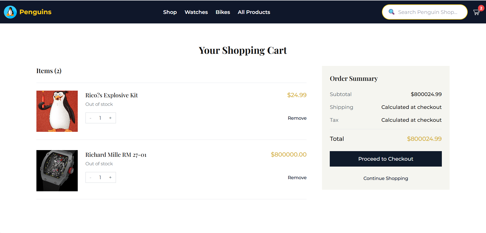
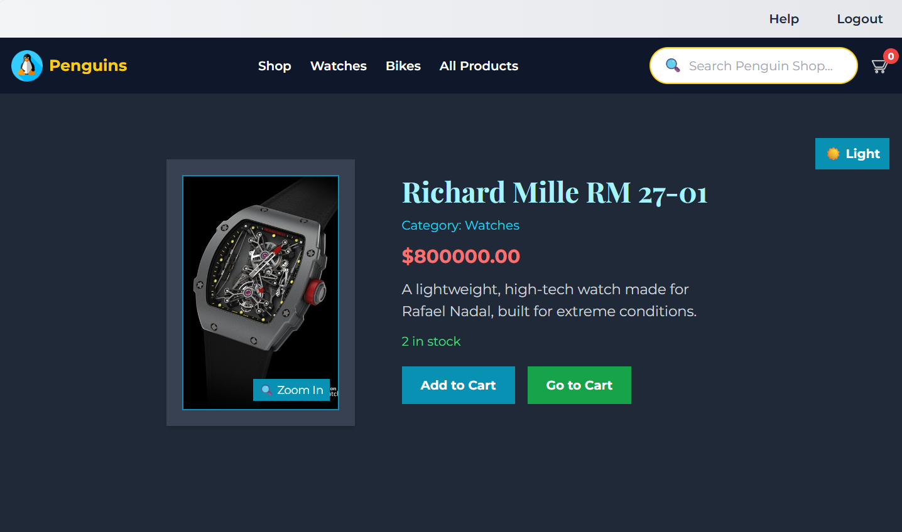
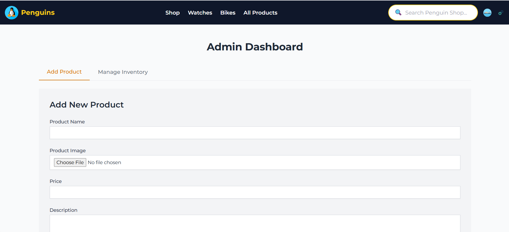

# Ecommerce Platform

A full-stack e-commerce platform built using **Node.js** and **Express.js** on the backend, **React.js** on the frontend, and **MySQL** as the database. It supports product browsing, cart management, secure user authentication, and robust admin features for order and inventory management.

## Screenshots

### Homepage


### Cart view


### Product detail


### admin panel



---

## 🗂 Project Structure

```
Ecommerce/
├── backend/
│   ├── config/             # Database configuration and connection
│   ├── controllers/        # Business logic
│   ├── middleware/         # JWT & role-based authentication
│   ├── models/             # MySQL table interaction
│   ├── routes/             # API endpoints
│   └── index.js            # Entry point for backend
├── frontend/
│   ├── public/             # Static assets
│   └── src/
│       ├── Components/     # Reusable components
│       ├── Pages/          # Pages like Home, Product, Admin, etc.
│       ├── Context/        # Global state (e.g. Cart context)
│       └── Utils/          # API communication helpers
├── .gitignore
├── README.md
```

---

## 🚀 Features

### ✅ Frontend
- 🛒 Product Browsing, Search, and Filtering
- 🧾 Cart and Checkout System
- 🔐 User Authentication (JWT-based)
- 🧑‍💻 Admin Panel for Orders and Products
- 💡 Responsive UI (Tailwind CSS)

### ✅ Backend
- 🔧 RESTful API using Express.js
- 🗃 MySQL Integration for persistent data
- 🛡 JWT Authentication + Middleware
- 📦 Complete Order and Payment Flow

---

## 🗃 Database Schema

Your MySQL database `ecommerce_db` includes the following tables:

```sql
CREATE TABLE users (
  id INT AUTO_INCREMENT PRIMARY KEY,
  username VARCHAR(255) UNIQUE NOT NULL,
  password VARCHAR(255) NOT NULL,
  role ENUM('customer', 'admin') DEFAULT 'customer'
);

CREATE TABLE categories (
  id INT AUTO_INCREMENT PRIMARY KEY,
  name VARCHAR(100) NOT NULL
);

CREATE TABLE products (
  product_id INT AUTO_INCREMENT PRIMARY KEY,
  name VARCHAR(255) NOT NULL,
  price DECIMAL(10,2),
  description TEXT,
  image_url VARCHAR(255),
  stock INT,
  category_id INT,
  FOREIGN KEY (category_id) REFERENCES categories(id)
);

CREATE TABLE cart (
  cart_id INT AUTO_INCREMENT PRIMARY KEY,
  user_id INT,
  product_id INT,
  quantity INT,
  FOREIGN KEY (user_id) REFERENCES users(id),
  FOREIGN KEY (product_id) REFERENCES products(product_id)
);

CREATE TABLE orders (
  order_id INT AUTO_INCREMENT PRIMARY KEY,
  user_id INT,
  total_amount DECIMAL(10,2),
  order_status ENUM('Pending', 'Shipped', 'Delivered', 'Cancelled') DEFAULT 'Pending',
  created_at TIMESTAMP DEFAULT CURRENT_TIMESTAMP,
  FOREIGN KEY (user_id) REFERENCES users(id)
);

CREATE TABLE order_items (
  id INT AUTO_INCREMENT PRIMARY KEY,
  order_id INT,
  product_id INT,
  quantity INT,
  price DECIMAL(10,2),
  FOREIGN KEY (order_id) REFERENCES orders(order_id),
  FOREIGN KEY (product_id) REFERENCES products(product_id)
);

CREATE TABLE payments (
  id INT AUTO_INCREMENT PRIMARY KEY,
  order_id INT,
  payment_status ENUM('Pending', 'Paid', 'Failed') DEFAULT 'Pending',
  payment_method VARCHAR(100),
  created_at TIMESTAMP DEFAULT CURRENT_TIMESTAMP,
  FOREIGN KEY (order_id) REFERENCES orders(order_id)
);

CREATE TABLE payments_backup LIKE payments;
CREATE TABLE orders_backup LIKE orders;
```

---

## 🧰 Prerequisites

- [Node.js](https://nodejs.org/) (v16+)
- [npm](https://www.npmjs.com/)
- [MySQL](https://www.mysql.com/) (v8+)
- [Git](https://git-scm.com/)

---

## ⚙️ Setup Instructions

### 1️⃣ Clone the Repository

```bash
git clone https://github.com/Shantanu-00/Ecommerce.git
cd Ecommerce
```

### 2️⃣ Backend Setup

```bash
cd backend
npm install
```

#### Create `.env` File

```env
PORT=5000
DB_HOST=localhost
DB_USER=your_mysql_username
DB_PASSWORD=your_mysql_password
DB_NAME=ecommerce_db
JWT_SECRET=your_secret_key
```

#### Initialize MySQL Database

```sql
CREATE DATABASE ecommerce_db;
-- Then import the SQL schema provided above.
```

#### Start Backend Server

```bash
npm start
```
- Server runs at: [http://localhost:5000](http://localhost:5000)

### 3️⃣ Frontend Setup

```bash
cd ../frontend
npm install
npm start
```
- App opens at: [http://localhost:3000](http://localhost:3000)

---

## 🛠 Technologies Used

- **Frontend**: React.js, Tailwind CSS, React Router
- **Backend**: Node.js, Express.js, JWT
- **Database**: MySQL
- **Tooling**: npm, PostCSS, dotenv

---

## 🤝 Contributing

1. Fork the repo
2. Create your feature branch: `git checkout -b feature/your-feature`
3. Commit your changes: `git commit -m "Add some feature"`
4. Push to the branch: `git push origin feature/your-feature`
5. Open a pull request

---

## 📄 License

This project is **unlicensed** — free to use and modify.

---

## 📫 Contact

- GitHub: [Shantanu-00](https://github.com/Shantanu-00)
